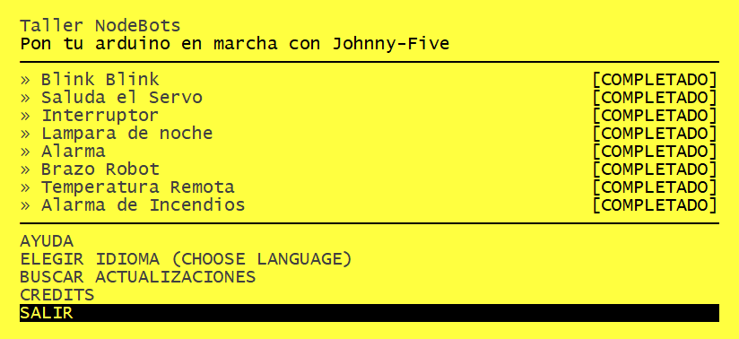

# Taller de Nodebots

[](https://travis-ci.org/tableflip/nodebot-workshop) [](https://david-dm.org/tableflip/nodebot-workshop) [](https://gitter.im/tableflip/nodebot-workshop?utm_source=badge&utm_medium=badge&utm_campaign=pr-badge&utm_content=badge)


Un taller de [nodeschool][1] para poner tu Arduino en marcha con [rwaldron/johnny-five][2]

```shell
# Install
npm install -g taller-nodebots
# Run
taller-nodebots
```



Una serie de desafíos de código le enseñará los conceptos básicos de la api [johnny-five][2], un marco para trabajar con Arduino y otras placas de creación rápida de prototipos.

## El hardware es opcional

El taller planteará un desafío, usted codificará una solución que el taller luego verifica.

** Estarás escribiendo _codigo ejectuable de johnny-five code _. **

Cada una de sus soluciones puede ser ejecutada por el taller o directamente como un programa 'node'.

Cuando se ejecuta en el taller, el código de bajo nivel para hablar con el Arduino se apaga.

Conecte un Arduino, conecte el USB y ejecute su solución directamente para ver que se ejecute de verdad.

## Como contribuir

### Estilo de código

Para avanzar hacia un estilo consistente para proyectos de nodos escolares, usamos .jshintrc
como se define en learnyounode: https://github.com/rvagg/learnyounode/blob/master/.jshintrc

### Pruebas y Commits

Los scripts npm están presentes para tests y linting:

```
$ npm run test
$ npm run lint
```

Un `pre-commit` hook va instalado para ejecutar los tests y linting con cada commit.

## Gracias al Equipo

- @rvagg - and the [nodeschool.io][1] team
- @rwaldron and the [johnny-five team](https://github.com/rwaldron/johnny-five/graphs/contributors)
- @voodootikigod and the [nodebots team](http://nodebots.io/core.html)
- @AnnaGerber of [node-ardx.org](http://node-ardx.org/)

## Traduciones

- @gorhgorh - French
- @sdesalas - Espanol

[1]: http://nodeschool.io/
[2]: https://github.com/rwaldron/johnny-five

Brought to you by [@NodeBotsES](https://twitter.com/NodeBotsES)
